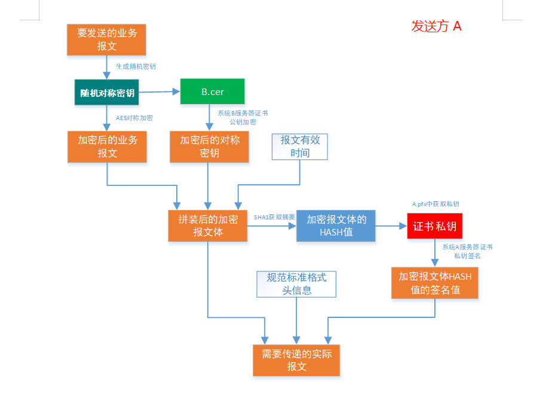
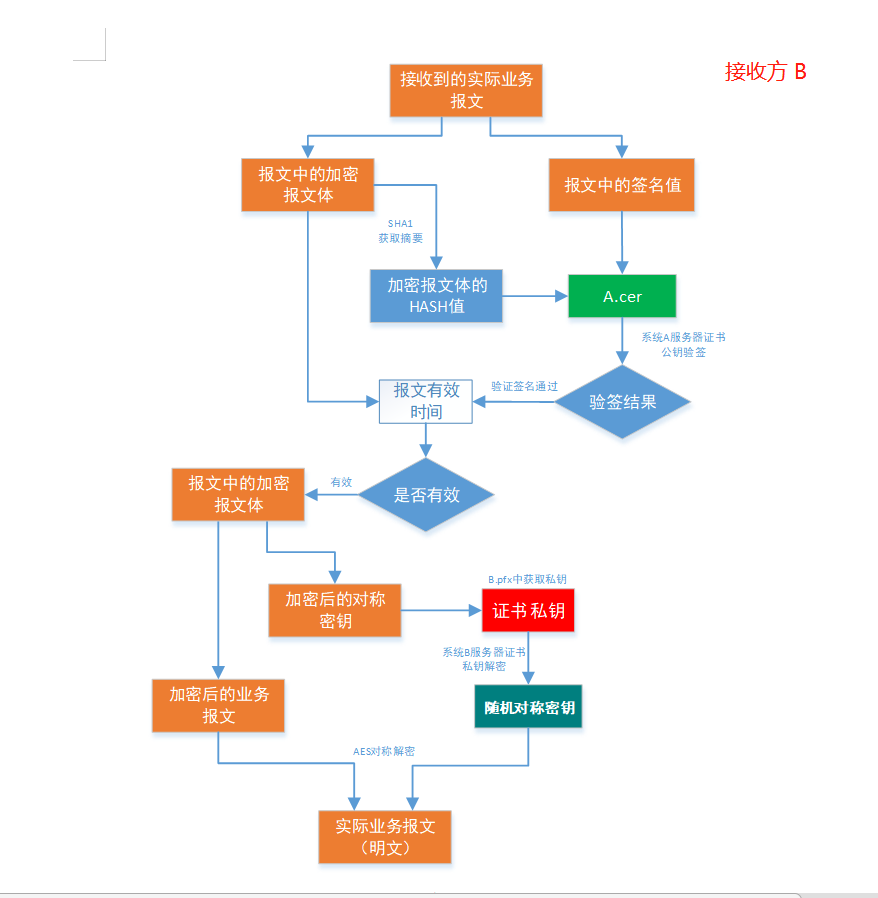

# 								数据安全

## 常识：

**传输的数据信息要具有**： **保密性**，**完整性**，**不可抵赖性**，可用性，可控性 等性质。

**加解密：数据的保密性**

**加签验签：数据的完整性/防第三方篡改**

**私钥加密:** **数据的不可抵赖性**

证书： pfx证书有私钥。cer有公钥，没有私钥

## 一个标准、常见的数据传输 例子：

#### 准备：非对称加密  两对密钥（rsa、dsa、ecc）；对称加密算法 1个（aes,des，...）；摘要算法1个（sha1,sah256,md5...）

​			摘要算法=散列算法=哈希算法。3种表述。

####  方向： A->B

####  发送方A：

####  接收方B:

## 国密算法

https://www.cnblogs.com/zhangshitong/p/8057845.html

国密即国家密码局认定的国产密码算法。主要有SM1，SM2，SM3，SM4。密钥长度和分组长度均为128位。

SM1 为对称加密。其加密强度与AES相当。该算法不公开，调用该算法时，需要通过加密芯片的接口进行调用。

**SM2为非对称加密**，基于ECC。该算法已公开。由于该算法基于ECC，故其签名速度与秘钥生成速度都快于RSA。ECC 256位（SM2采用的就是ECC 256位的一种）安全强度比RSA 2048位高，但运算速度快于RSA。

SM3 消息摘要。可以用MD5作为对比理解。该算法已公开。校验结果为256位。

SM4 无线局域网标准的分组数据算法。**对称加密**，密钥长度和分组长度均为128位。

