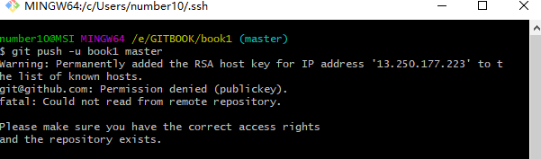
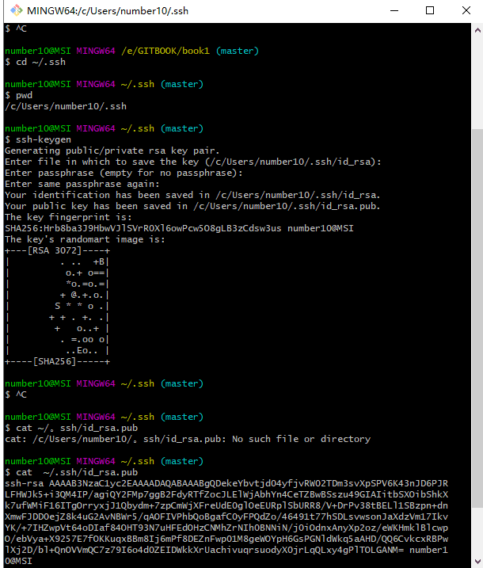

# 本地项目git命令提交远程git仓库

**step1:**      `git初始化本地仓库（respository）,打开项目所在目录，在git bash 里执行 ` [初始化](https://git-scm.com/book/zh/v2/Git-基础-获取-Git-仓库)

```basic
$ git init
```


**step2:**   `添加远程仓库,创建主分支` 

sshkey模式[^2-1]

```basic
$ git remote add origin git@github.com:number-10/GITBOOK.git 

```

https模式[^2-2]

```
$ git remote add origin https://github.com/number-10/Library-sframe.git 
```


**step3:** `查看远程仓库，更改别名。origin可设为其它别名`

```basic
$ git remote -v  
$ git remote  rename origin originNewName
```


**step4:** `把本地仓库的变化连接到远程仓库主分支`   **重要**[^q4]

```basic
 $ git pull origin master  
```


**step5:**`把本地仓库的文件推送到远程仓库[^q5]

```basic
 $ git add -A
 $ git commit -m "注释"
 $ git push -u origin master 
```


*origin 项目地址别名，默认是origin；master为分支，主分支默认是master*

*第一次推送用 -u 选定默认主机，分支。之后可省略 ,直接git push*


[^2-1]:  sshkey 方式，需要配密钥
[^2-2 ]: https方式 需要下载更新Windows的git凭证管理器 [GCMW-1.14.0.exe](https://github.com/Microsoft/Git-Credential-Manager-for-Windows/releases/) ; 出现该提示信息的主要原因是Github禁用        了TLS v1.0 and v1.1这种弱加密标准，此时需要手动更新.


## Q:

[^q4 ]: 获取远程服务器文件,建立连接. 

 **Q :** fatal: refusing to merge unrelated histories (致命的：拒绝合并无关的历史) 

 **A:** 

​      **s1:** `$ git log -p master..origin/master`  查看本地master分支和远程(origin)分支的区别

```
$ git log -p master..origin/master
commit c2808513b3ec0962916cf904e5c7f26e368188c9 (origin/master)
Author: number-10 <33895331+number-10@users.noreply.github.com>
Date:   Fri Jun 5 10:00:58 2020 +0800

    Initial commit

diff --git a/.gitignore b/.gitignore
new file mode 100644
```

​    **s2:** `$git pull --rebase origin masterr`    将远程代码pull 下来.

```
$ git pull --rebase origin master
From github.com:number-10/Library-sframe-sc
 * branch            master     -> FETCH_HEAD
First, rewinding head to replay your work on top of it...
Applying: 初始化
.git/rebase-apply/patch:455: trailing whitespace.
-- 初始数据
.git/rebase-apply/patch:592: trailing whitespace.
  (
.git/rebase-apply/patch:608: trailing whitespace.
    FOREIGN KEY (SCHED_NAME,TRIGGER_NAME,TRIGGER_GROUP)
.git/rebase-apply/patch:926: trailing whitespace.
 *
.git/rebase-apply/patch:969: trailing whitespace.
 *
warning: squelched 2086 whitespace errors
warning: 2091 lines add whitespace errors.
Using index info to reconstruct a base tree...
Falling back to patching base and 3-way merge...
CONFLICT (add/add): Merge conflict in README.md
Auto-merging README.md
CONFLICT (add/add): Merge conflict in LICENSE
Auto-merging LICENSE
error: Failed to merge in the changes.
hint: Use 'git am --show-current-patch' to see the failed patch
Patch failed at 0001 初始化
Resolve all conflicts manually, mark them as resolved with
"git add/rm <conflicted_files>", then run "git rebase --continue".
You can instead skip this commit: run "git rebase --skip".
To abort and get back to the state before "git rebase", run "git rebase --abort".
```

**s3:** `git reabase --continue`    `git am --show-current-patch`根据提示解决冲突 .

可以idea工具等到具体页面修改文件内容,删除文件.解决好后再次执行

`git reabase --continue`  会提示:

```
$ git rebase --continue
You must edit all merge conflicts and then
mark them as resolved using git add
```

参考:https://www.jianshu.com/p/afe505fa0b3


[^q5 ]: git push -u origin master   Q:

```
 ! [rejected]        master -> master (non-fast-forward)
error: failed to push some refs to 'git@github.com:number-10/Library-sframe-sc.git'
hint: Updates were rejected because the tip of your current branch is behind
hint: its remote counterpart. Integrate the remote changes (e.g.
hint: 'git pull ...') before pushing again.
hint: See the 'Note about fast-forwards' in 'git push --help' for details.

```

**analysis:**  出现在首次上传代码时. 远程分支和本地分支不一样,服务器上有的 文件 , 但是本地仓库没有;提示你先进行 pull操作
**A1:**进行 一下(**第4步骤**),

**A2:** 强行推送. 覆盖服务器的代码,最终服务器代码和本地一致(服务器的代码可能都是) 适用于git仓库才建立场景

```
git push -f
```


## 可能遇到的问题

### problem 1: [git push时提示--set-upstream](https://www.cnblogs.com/blog-yuesheng521/p/10670778.html)

*fatal: The current branch master has no upstream branch.
To push the current branch and set the remote as upstream, use
git push --set-upstream origin master*

* **翻译解释：**

致命的：当前的分支主机没有上游分支。
要推送当前分支并将远程设置为上游，请使用
git push --set-upstream origin master

*远程指的的是step2的远程仓库/主机。

**虽然添加了远程仓库，但是没有指定远程仓库的哪个分支**

* **分析：**

git分支与远程主机存在对应分支，可能是单个可能是多个。 

simple方式：如果当前分支只有一个追踪分支，那么git push origin到主机时，可以省略主机名。 
matching方式：如果当前分支与多个主机存在追踪关系，
**git push --set-upstream origin master（省略形式为：git push -u origin master）**将本地的master分支推送到origin主机且--set-upstream选项会指定一个默认主机，同时指定该主机为默认主机，后面使用可以不加任何参数使用git push。

* **注意:**

Git 2.0版本之前，默认采用matching方法，现在改为默认采用simple方式。

**当前的分支主机没有上游分支原因：**
1.当前版本小于2.0
2.当前分支与多个主机存在对应关系，而当前未指定对应关系
3.其它，**todo**


* **解决方案：**

  **执行step4后**
  
  **方案a：**
  
  ```
  git push --set-upstream origin master 
  ```
or
  ```
  git push -u origin master
  ```
  
  
  
  
  
  **方案b:**
  
  --set-upstream-to  即 -u  指定本地分支和服务器分支映射关系, origin 远程主机，前面的mster 服务器分支，后面的master 为本地分支，可省略。两个分支名可以不一样
  
  
  
  **指定本地分支和服务器分支映射关，后面的master为本地分支，可省略**
  
  ```basic
  $ git branch -u origin/master master
  ```
  
  
  
  查看本地分支映射关系 []里的为远程主机/映射的远程分支
  
  ```basic
  $ git branch -vv  
  * master d06de5c [origin/master] clone tj
  ```
  
  
  
  移除本地分支映射关系
  
  ```basic
  $ git branch --unset-upstream
  ```
  
  
  
  详见[set-upstream-to用法](https://blog.csdn.net/tterminator/article/details/78108550)
  
  

参考：https://www.cnblogs.com/alex-415/p/6912294.html

​           https://blog.csdn.net/tterminator/article/details/78108550


## problem 2: no branch, rebasing maste

**Q:**

```
$ git branch -v
 *(no branch, rebasing master) 5299bf1 <E6><B3><A8>0605
  master                       796aba0 <C3><A6><C2><B3>int sc
```


**analysis:**  当前为空分支


**A1: ** **git checkout -b [分支名]**  此时新创建的分支与*（no branch）一样

    $ git checkout -b master2
    Switched to a new branch 'master2'
    
    $ git branch -vv
      master  796aba0 <C3><A6><C2><B3>int sc
    * master2 5299bf1 <E6><B3><A8>0605

   新建后分支默认切换到新建的分支master2 上了.即*所指向位置


* **指定本地分支和服务器分支映射关系，后面的master为本地分支，可省略**

```
$ git branch -u origin/master master
```

```
$ git branch -u origin/master master2
Branch 'master2' set up to track remote branch 'master' from 'origin'.

$ git branch -vv
  master  796aba0 <C3><A6><C2><B3>int sc
* master2 5299bf1 [origin/master: ahead 4] <E6><B3><A8>0605

```


**A2:      **2个分支合并 //todo

2：如果想将*（no branch）合并到主分支master，则首先执行git log命令，记住第一行的id号，然后执行git checkout master命令，此时出现的第一行信息中也会出现一个id号，与之前执行git log中第一行出现的id号是一致的，此时就已经切换到了主分支上来了，然后执行git merge id将*（no branch）软件合并到主分支；
原文链接：https://blog.csdn.net/guoguo295/java/article/details/8205875

https://serverfault.com/questions/56722/git-seemed-to-be-in-no-branch-and-then-lost-my-changes


## problem 3: git push -u origin master  没有设置公钥

```
Warning: Permanently added the RSA host key for IP address '13.250.177.223' to the list of known hosts.
git@github.com: Permission denied (publickey).
fatal: Could not read from remote repository.
```



解决方案



1首先`ssh-keygen`会确认密钥钥的存储位置（默认是`.ssh/id_rsa`），然后它会要求你输入两次密钥口令。如果你不想在使用密钥时输入口令，将其留空即可。


```basic
$ cd ~/.ssh

number10@MSI MINGW64 ~/.ssh (master)
$ pwd
/c/Users/number10/.ssh

number10@MSI MINGW64 ~/.ssh (master)
$ ssh-keygen
Generating public/private rsa key pair.
Enter file in which to save the key (/c/Users/number10/.ssh/id_rsa)://建议直接回车 默认是
																"/c/Users/number10/.ssh"
Enter passphrase (empty for no passphrase): //输入密钥口令 建议为空直接回车
Enter same passphrase again: //输入密钥口令 建议为空直接回车
Your identification has been saved in /c/Users/number10/.ssh/id_rsa.
Your public key has been saved in /c/Users/number10/.ssh/id_rsa.pub.
The key fingerprint is:
SHA256:Hrb8ba3J9HbwVJlSVrR0Xl6owPcw5O8gLB3zCdsw3us number10@MSI
The key's randomart image is:
 
```

2 在把公钥发送到远程服务器

现在，进行了上述操作的用户需要将各自的公司发送给任意一个Git服务器管理员（假设服务器正在使用基于公司的SSH验证设置）。他们所要做的就是复制各自的`.pub`文件内容，发送到服务器。

1. In the upper-right corner of any page, click your profile photo, then click **Settings**.

   

   

2. In the user settings sidebar, click **SSH and GPG keys**.

   

   

3. Click **New SSH key** or **Add SSH key**.

   

   

4. In the "Title" field, add a descriptive label for the new key. For example, if you're using a personal Mac, you might call this key "Personal MacBook Air".

5. Paste your key into the "Key" field.

   

   

6. Click **Add SSH key**.

   

   

7. If prompted, confirm your GitHub password.

   

[官方文档 Git-生成-SSH-公钥](https://git-scm.com/book/zh/v2/服务器上的-Git-生成-SSH-公钥)

[官方文档 生成github公钥](https://help.github.com/en/articles/adding-a-new-ssh-key-to-your-github-account)

[^1]: 
[^2]: 