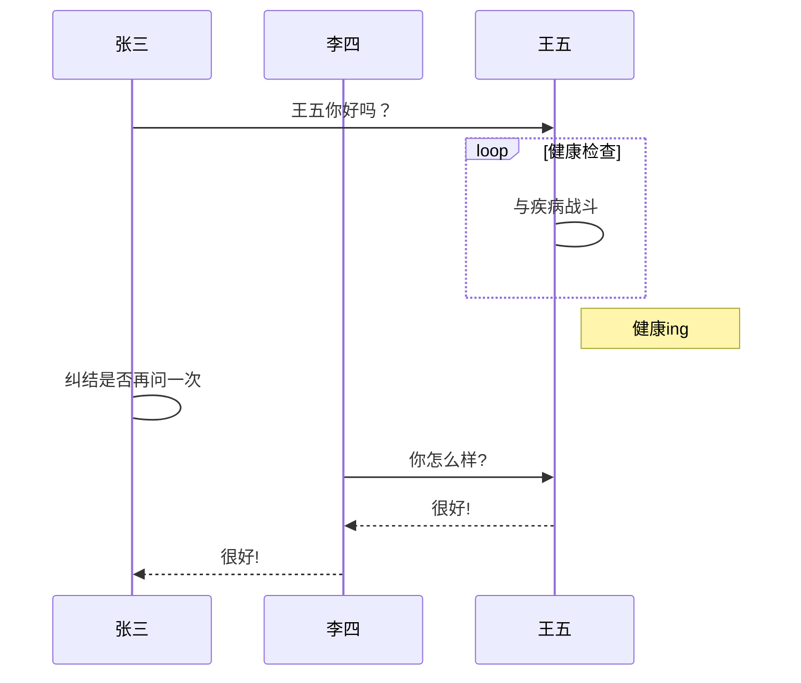
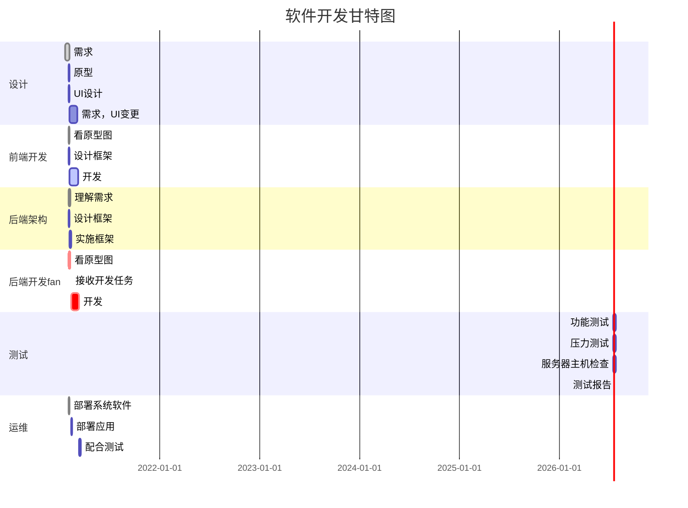

# markdown

[TOC]

<!-- toc -->

## 基本语法

### 转义:  \\    在\*、\[、\]、\(、\)、\\  前加 \ 即可转义

### 标题:  \# ##  ###  ... ######  标题 一级~六级,#后要跟空格。

### 加粗:   \*\*加粗内容\*\*            快捷键 CTRL+B
### 横线:  \*\*\*
### 斜体: \*斜体\*               快捷键 CTRL+I
### 链接:`` [name](url) ``     快捷键 CTRL+K
### 标注：todo
### 引用：\>
### 图片：\![图片\]\(url\)       **快捷键  CTRL+SHIFT+I**
```


图片源：放在同级的assets文件夹下
Chapter4
----------/assets
--------------------/photoName.png
---------/file
```

### 代码块:   \`\`\` 代码块 \`\`\`        **快捷键  CTRL+SHIFT+K**
### 无序列表： \* 

### 目录标识： 本地\[TOC\], 发布用 atoc/toc 插件，然后用\<\!\-\- toc \-\-\>

### 流程图


#### 图结构：

  \`\`\`**流程图标识** 

   流程图内容 

  \`\`\`

  **流程图标识：** **（代码块右下角的选择 *选择语言方框*）：flow、sequence、mermaid等


#### mermaid流程图

##### 正常mermaid流程图

图标识： mermaid

流程图方向: graph     LR:左->右;  TB、TD:上->下； RL:右->左；  BT:下->上

节点：id[图框内容]    

* [msg]代表方框；

* (msg)代表圆角方框；

* {msg}代表菱形框；

* ((msg))代表圆形；

* \>msg] 代表旗帜；


节点线：

* --> 带箭头实线

* -.- 虚线     -.-> 箭头虚线   -.text.-> 箭头虚线中间文字
  
* ==> 箭头加粗实线
  

  
  ```
  ​```mermaid
  graph LR
  
  F[横向流程图]
  
  a1[a11] ==> b1(b1)
  b1 -.xx.-x c1((c1))
  c1 -.-> |a=2| d1>d1]
  c1 -->  |a=2| d2
  c1 -->  |a=2| d3
  
  A[方形] -->B(圆角)
      B --> C{条件a}
      C -->|a=1| D[结果1]
      C -->|a=2| E[结果2]
  ​```
  ```
  
  ```mermaid
  graph LR
  
  F[横向流程图]
  
  a1[a11] ==> b1(b1)
  b1 -.xx.-x c1((c1))
  c1 -.-> |a=2| d1>d1]
  c1 -->  |a=2| d2
  c1 -->  |a=2| d3
  
  A[方形] -->B(圆角)
      B --> C{条件a}
      C -->|a=1| D[结果1]
      C -->|a=2| E[结果2]
  ```


##### 特殊1 ：mermaid中的 UML时序图  **sequenceDiagram 关键字**

```
​```mermaid
 %% 时序图例子,-> 直线，-->虚线，->>实线箭头
  sequenceDiagram
    participant 张三
    participant 李四
    张三->>王五: 王五你好吗？
    loop 健康检查
        王五->王五: 与疾病战斗
    end
    Note right of 王五: 健康ing
   
    张三->张三: 纠结是否再问一次
    李四->>王五: 你怎么样?
    王五-->>李四: 很好!
    李四-->>张三: 很好!
```



##### 特殊2 ：mermaid中的  甘特图          **gantt关键字**

```
​```mermaid
%% 语法示例
gantt
dateFormat  YYYY-MM-DD
title 软件开发甘特图

section 设计
需求                      :done,    des1, 2021-01-20,2021-02-05
原型                      :active,  des2, 2021-02-01,2021-02-05
UI设计                    :         des3, 2021-02-01, 3d
需求，UI变更               :         des4, after des3, 30d

section 前端开发
看原型图             		:done, devFront1, 2021-02-02,2021-02-05
设计框架                    :active, frameFront,2021-02-02, 4d
开发                       :active, devFront2,after frameFront,30d


section 后端架构
理解需求           		    :done, jgT1, 2021-02-02,7d
设计框架                    :active, jgT2,2021-02-02, 4d
实施框架                    :active, jgT3,after jgT2, 4d

section 后端开发fan
看原型图             		:done,crit, devT1, 2021-02-02,6d
接收开发任务             		:done,crit, devT2, after jgT3,1d
开发                       :crit,devT3,after devT2,30d


section 测试
功能测试                    :         test1, after dev2, 7d
压力测试                    :         test2, after dev2, 7d
服务器主机检查               :         test2, after dev2, 7d
测试报告                    :  						     1d     

section 运维
部署系统软件           	   :done,  om1, 2021-02-02,2021-02-05
部署应用           			:       om2, after jgT3,4d
配合测试                    :       om3,after devT3, 4d
​```
```




#### flow流程图

##### 正常

```
  st1=>start: 开始框
  op=>operation: 处理框
  cond=>condition: 判断框(是或否?)
  sub1=>subroutine: 子流程
  io=>inputoutput: 输入输出框
  e=>end: 结束框

  st1->op->cond
  cond(yes)->io->e
  cond(no)->sub1->op
```

```flow
  st1=>start: 开始框
  op=>operation: 处理框
  cond=>condition: 判断框(是或否?)
  sub1=>subroutine: 子流程
  io=>inputoutput: 输入输出框
  e=>end: 结束框

  st1->op->cond
  cond(yes)->io->e
  cond(no)->sub1->op
```

##### 横向

```
​```flow
st=>start: 开始框
op=>operation: 处理框
cond=>condition: 判断框(是或否?)
sub1=>subroutine: 子流程
io=>inputoutput: 输入输出框
e=>end: 结束框
st(right)->op(right)->cond
cond(yes)->io(bottom)->e
cond(no)->sub1(right)->op
​```
```

```flow
st=>start: 开始框
op=>operation: 处理框
cond=>condition: 判断框(是或否?)
sub1=>subroutine: 子流程
io=>inputoutput: 输入输出框
e=>end: 结束框

st(right)->op(right)->cond
cond(yes)->io(bottom)->e
cond(no)->sub1(right)->op
```


#### **UML时序图/sequence图**

没用participant定义节点。note里有A 或者A->B 会默认定义

```
​```sequence
Title: UML时序图
participant A
participant B
participant C

Note left of A1:  A1的描述
note over A,C: 一体
Note left of A:  A的描述
Note right of B: B的描述

A->B: 对象B你好吗?（请求）
B-->A: 我很好(响应)
A->B: 你真的好吗？
​```
```

```sequence
Title: UML时序图
participant A
participant B
participant C

note over A,C: 一体
Note left of A:  A的描述
Note right of B: B的描述

A->B: 对象B你好吗?（请求）
B-->A: 我很好(响应)
A->B: 你真的好吗？


```


## 工具

* **typora**  

  https://typora.io/

  http://support.typora.io/What's-New-0.9.90/