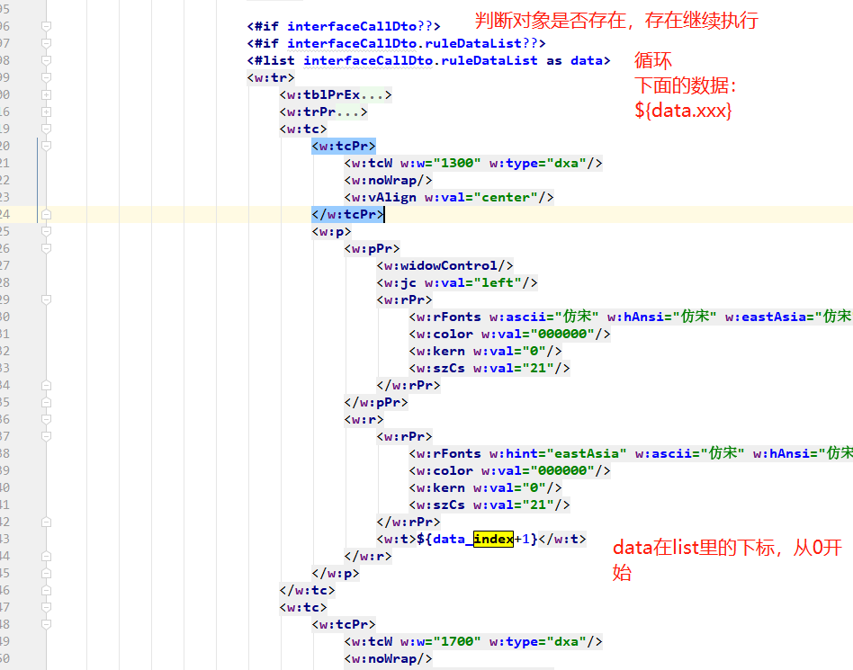

# freemarker

官网 http://freemarker.foofun.cn/

FreeMarker 是一款 *模板引擎*： 即一种基于模板和要改变的数据， 并用来生成输出文本(HTML网页，电子邮件，配置文件，源代码等)的通用工具。 它不是面向最终用户的，而是一个Java类库，是一款程序员可以嵌入他们所开发产品的组件。


这种方式通常被称为 [MVC (模型 视图 控制器) 模式](http://freemarker.foofun.cn/gloss.html#gloss.MVC)。

## 作用（word文档）

我用来生成word文档。

##  1 创建 Configuration 对象，配置参数


```
private static Configuration configuration = null;
configuration = new Configuration(Configuration.VERSION_2_3_23);
configuration.setDefaultEncoding("utf-8");
configuration.setNumberFormat("computer"); //默认数字3个加','号。去除数字,号
```

## 2 生成模板文件 并加载到配置对象里

#### 生成模板： 

 * 用对应word文件，另存为xml文件

 * 打开xml文件，要展示的内容，替换为 ${xxx}。xxx应该是后台接口返回的map里的key

   

#### 加载模板文件夹：

**方式1----模板文件夹在java目录里(相对路径)：**

**configuration.setClassForTemplateLoading(WordUtils.class, "/templates");**

静态代码块用本身类名，普通类用this

目录结构：

```
utils/

----word/

------------templates/

---------------------------w1.ftl

---------------------------w2.ftl

------------wordUtils.java
```

```
configuration.setClassForTemplateLoading(WordUtils.class, "/templates");
```

结果再次生效的目录结构：如下

薛定谔？

项目名称

 -- src

-------main

------------------java

------------------resources

-------------------------------templates/

------------------------------------------------w1.ftl

------------------------------------------------w2.ftl


**方式2---模板文件在（绝对路径）**

**configuration.setDirectoryForTemplateLoading(new File(templateFolder));**

```
//windows
private static final String templateFolder ="D:\\SOFT_WORK\\IDEA\\IDEA_WORKSPACE\\ghf\\ghf-support\\src\\main\\java\\com\\linkage\\support\\common\\utils\\word\\template";

//linux
private static final String templateFolder = "/data/packages/templates/";

configuration.setDirectoryForTemplateLoading(new File(templateFolder));
```


**方式3--模板文件在webRoot(没测试过)**

 setServletContextForTemplateLoading(context, "/ftl") 就是 /WebRoot/ftl目录。

## 3 生成对应文件

* 选择一个配置模板

  Template freemarkerTemplate = configuration.getTemplate(ftlFile);

* 生成文件

  //dataMap map数据对象；w  空文件/用于写入字符流的抽象类

  freemarkerTemplate .process(dataMap,w)

  

  

  ```
  public static File createDoc2(Map<?, ?> dataMap, String ftlFile) throws  Exception{
     String path = System.getProperty("user.dir")+"/";
  
     String name =  "eg.doc";
     Template freemarkerTemplate = configuration.getTemplate(ftlFile);
     Template t = freemarkerTemplate;
     log.info("word临时文件路径："+path+name);
     File f = new File(path+name);
  
     try {
        // 这个地方不能使用FileWriter因为需要指定编码类型否则生成的Word文档会因为有无法识别的编码而无法打开
        Writer w = new OutputStreamWriter(new FileOutputStream(f), "utf-8");
        t.process(dataMap, w);
        w.close();
     } catch (Exception ex) {
        ex.printStackTrace();
        throw new RuntimeException(ex);
     }
     return f;
  }
  ```


## 一些配置及注意事项

* ftl模板里的判空、循环、循环下标 。循环可包括html Dom。用来实现word里面的 表格。

  **判空：** <#if interfaceCallDto??> </#if>

  **循环：**     <#list interfaceCallDto.ruleDataList as data> </#if>

  ​         **循环下标：** ${data_index}


**例：**

```
<#if interfaceCallDto??>
    <#if interfaceCallDto.ruleDataList??>
        <#list interfaceCallDto.ruleDataList as data>
			.....
        </#if>
    </#list>
</#if>
```

实际数据对象 map

```
 Map map = new HashMap(16);
 ist<MonthDataDto> dataSameList = thread1.getDataList();
 map.put("dataSameList", dataSameList);

List<MonthDataDto> dataList = thread2.getDataList();
map.put("dataList", dataList);

InterfaceCallDto interfaceCallDto = thread3.getInterfaceCallDto();
map.put("interfaceCallDto", interfaceCallDto);

```


interfaceCallDto 对象

```
@Data
public class InterfaceCallDto implements Serializable {
   private static final long serialVersionUID = 1L;

    private List<RuleDataDto> ruleDataList;

   @ApiModelProperty(value = "竖合计-原有调用总量",example = "2")
   private Long originalCallTotal;

   @ApiModelProperty(value = "竖合计-今月新增总量",example = "2")
   private Long thisMonthAddTotal;


   @ApiModelProperty(value = "总量",example = "4")
   private Long crossTotal;


}
```


例：



 

**生成文件接口：**

```
/**
     *     月报word文件
     */
    @GetMapping("/getMonthSummaryReportWord")
    @ApiOperation(value = "下载月报", notes = "下载月报")
    @ApiResponses(value = {@ApiResponse(code = 400, message = "自定义错误"), @ApiResponse(code = 500, message = "服务器错误")})
     public void getCreditReportWord(@Pattern(regexp="^[1-3]\\d{3}\\-(0[1-9]|1[0-2])$",message="日期格式不正确,格式应为yyyy-MM,例：2021-04")  @RequestParam("monthStr")  String monthStr , HttpServletResponse response) throws Exception {
        //返回
        Map map = new HashMap(16);
        //主信息
        map.put("year",monthStr.substring(0,4));
        map.put("month",monthStr.substring(5,7));


        List<Thread> list=new ArrayList<Thread>();

        Date beginDate = new Date();
        log.info("main begin Time {}", DateUtils.format(beginDate,DateUtils.DATE_TIME_PATTERN));

        //1 same部门
        ReportThread1 thread1 = new ReportThread1();
        thread1.init(monthStr);
//
         list.add(thread1);
         thread1.start();


        //2 部门
        ReportThread2 thread2 = new ReportThread2();
        thread2.init(monthStr);

        list.add(thread2);
        thread2.start();


        //3 接口调用
        ReportThread3 thread3 = new ReportThread3();
        thread3.init(monthStr);

        list.add(thread3);
        thread3.start();


        //等待所有子线程执行玩在执行主线程
        for(Thread t : list){
            t.join();
        }
        Date endDate = new Date();
        log.info("main end Time {}", DateUtils.format(endDate,DateUtils.DATE_TIME_PATTERN));
        log.info("main cost Time {}", (endDate.getTime()-beginDate.getTime())*1.0/1000+"s");


        List<MonthDataDto> dataSameList = thread1.getDataList();
        map.put("dataSameList", dataSameList);


        List<MonthDataDto> dataList = thread2.getDataList();
        map.put("dataList", dataList);


        InterfaceCallDto interfaceCallDto = thread3.getInterfaceCallDto();
        map.put("interfaceCallDto", interfaceCallDto);

        File file = WordUtils.createDoc2(map, "monthSummaryReportWord.ftl");

        reponseSet(response, file,monthStr);


    }

    private void reponseSet(HttpServletResponse response, File file, String monthStr) throws Exception {
        InputStream fin = null;
        ServletOutputStream out = null;
        String  fileName = "桂花分平台数据月报("+monthStr+").docx";
        fileName = new String(fileName.getBytes("UTF-8"),"ISO-8859-1");
        response.setContentType("application/msword");
        response.setHeader("Content-Disposition", "attachment;filename="+ fileName);
        OutputStream os = response.getOutputStream();
        response.setHeader("Content-Type", "text/html;charset=UTF-8");


        fin = new FileInputStream(file);
        out = response.getOutputStream();


        // 缓冲区
        byte[] buffer = new byte[512];
        int bytesToRead = -1;
        while ((bytesToRead = fin.read(buffer)) != -1) {
            out.write(buffer, 0, bytesToRead);
        }

        if (fin != null) {
            fin.close();
        }
        if (out != null) {
            out.close();
        }

    }
```

