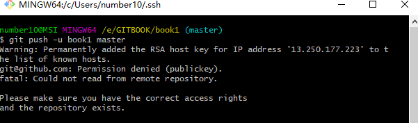

# 本地项目git命令提交远程git仓库

`1 git初始化本地仓库（respository）,打开项目所在目录，在git bash 里执行 ` [初始化](https://git-scm.com/book/zh/v2/Git-基础-获取-Git-仓库)

```basic
$ git init
```


`stp2 添加远程仓库,创建主分支`

```basic
$ git remote add origin git@github.com:number-10/GITBOOK.git
```


`3 查看远程仓库，更改别名。origin可设为其它别名`

```basic
$ git remote -v  
$ git remote  rename origin originNewName
```


`4 把本地仓库的变化连接到远程仓库主分支`   **重要**

```basic
 $ git pull origin master  
```


`5 把本地仓库的文件推送到远程仓库`

```basic
 $ git add -A
 $ git commit -m "注释"
 $ git push -u origin master 
```


*origin 项目地址别名，默认是origin；master为分支，主分支默认是master*

*第一次推送用 -u 选定默认主机，分支。之后可省略 ,直接git push*


## 可能遇到的问题

### problem 1: [git push时提示--set-upstream](https://www.cnblogs.com/blog-yuesheng521/p/10670778.html)

*fatal: The current branch master has no upstream branch.
To push the current branch and set the remote as upstream, use
git push --set-upstream origin master*

* **翻译解释：**

致命的：当前的分支主机没有上游分支。
要推送当前分支并将远程设置为上游，请使用
git push --set-upstream origin master

*远程指的的是step2的远程仓库/主机。

**虽然添加了远程仓库，但是没有指定远程仓库的哪个分支**

* **分析：**

git分支与远程主机存在对应分支，可能是单个可能是多个。 

simple方式：如果当前分支只有一个追踪分支，那么git push origin到主机时，可以省略主机名。 
matching方式：如果当前分支与多个主机存在追踪关系，
**git push --set-upstream origin master（省略形式为：git push -u origin master）**将本地的master分支推送到origin主机且--set-upstream选项会指定一个默认主机，同时指定该主机为默认主机，后面使用可以不加任何参数使用git push。

* **注意:**

Git 2.0版本之前，默认采用matching方法，现在改为默认采用simple方式。

**当前的分支主机没有上游分支原因：**
1.当前版本小于2.0
2.当前分支与多个主机存在对应关系，而当前未指定对应关系
3.其它，**todo**


* **解决方案：**

  **执行step4后**
  
  **方案a：**
  
  ```
  git push --set-upstream origin master 
  ```
or
  ```
  git push -u origin master
  ```
  
  **方案b:**
  
  --set-upstream-to  即 -u  指定本地分支和服务器分支映射关系, origin 远程主机，前面的mster 服务器分支，后面的master 为本地分支，可省略。两个分支名可以不一样
  
  
  
  指定本地分支和服务器分支映射关，后面的master为本地分支，可省略
  
  ```basic
  $ git branch -u origin/master master
  ```
  
  
  
  查看本地分支映射关系 []里的为远程主机/映射的远程分支
  
  ```basic
  $ git branch -vv  
  * master d06de5c [origin/master] clone tj
  ```
  
  
  
  移除本地分支映射关系
  
  ```basic
  $ git branch --unset-upstream
  ```
  
  
  
  详见[set-upstream-to用法](https://blog.csdn.net/tterminator/article/details/78108550)
  
  

参考：https://www.cnblogs.com/alex-415/p/6912294.html

​           https://blog.csdn.net/tterminator/article/details/78108550


## problem 2: git push -u origin master  没有设置公钥

```
Warning: Permanently added the RSA host key for IP address '13.250.177.223' to the list of known hosts.
git@github.com: Permission denied (publickey).
fatal: Could not read from remote repository.
```



解决方案


1首先`ssh-keygen`会确认密钥钥的存储位置（默认是`.ssh/id_rsa`），然后它会要求你输入两次密钥口令。如果你不想在使用密钥时输入口令，将其留空即可。


```basic
$ cd ~/.ssh

number10@MSI MINGW64 ~/.ssh (master)
$ pwd
/c/Users/number10/.ssh

number10@MSI MINGW64 ~/.ssh (master)
$ ssh-keygen
Generating public/private rsa key pair.
Enter file in which to save the key (/c/Users/number10/.ssh/id_rsa)://建议直接回车 默认是
																"/c/Users/number10/.ssh"
Enter passphrase (empty for no passphrase): //输入密钥口令 建议为空直接回车
Enter same passphrase again: //输入密钥口令 建议为空直接回车
Your identification has been saved in /c/Users/number10/.ssh/id_rsa.
Your public key has been saved in /c/Users/number10/.ssh/id_rsa.pub.
The key fingerprint is:
SHA256:Hrb8ba3J9HbwVJlSVrR0Xl6owPcw5O8gLB3zCdsw3us number10@MSI
The key's randomart image is:
 
```

2 在把公钥发送到远程服务器

现在，进行了上述操作的用户需要将各自的公司发送给任意一个Git服务器管理员（假设服务器正在使用基于公司的SSH验证设置）。他们所要做的就是复制各自的`.pub`文件内容，发送到服务器。

1. In the upper-right corner of any page, click your profile photo, then click **Settings**.

   

   

2. In the user settings sidebar, click **SSH and GPG keys**.

   

   

3. Click **New SSH key** or **Add SSH key**.

   

   

4. In the "Title" field, add a descriptive label for the new key. For example, if you're using a personal Mac, you might call this key "Personal MacBook Air".

5. Paste your key into the "Key" field.

   

   

6. Click **Add SSH key**.

   

   

7. If prompted, confirm your GitHub password.

   

[官方文档 Git-生成-SSH-公钥](https://git-scm.com/book/zh/v2/服务器上的-Git-生成-SSH-公钥)

[官方文档 生成github公钥](https://help.github.com/en/articles/adding-a-new-ssh-key-to-your-github-account)